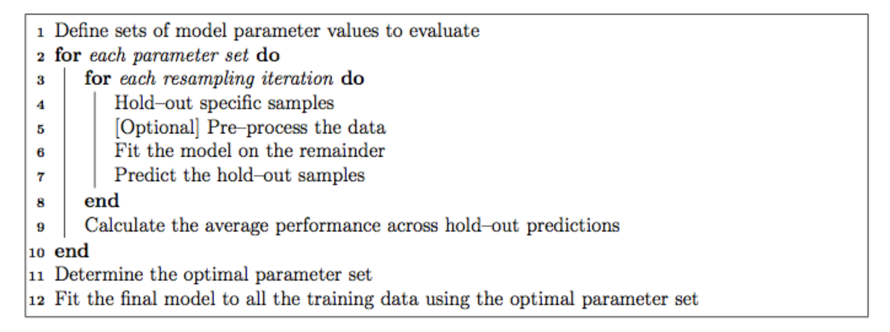
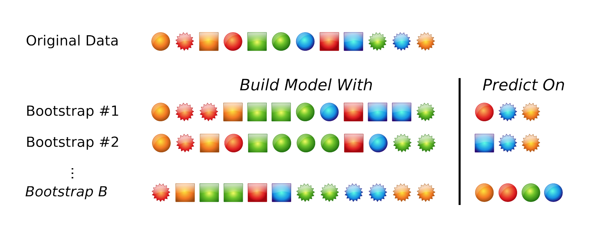
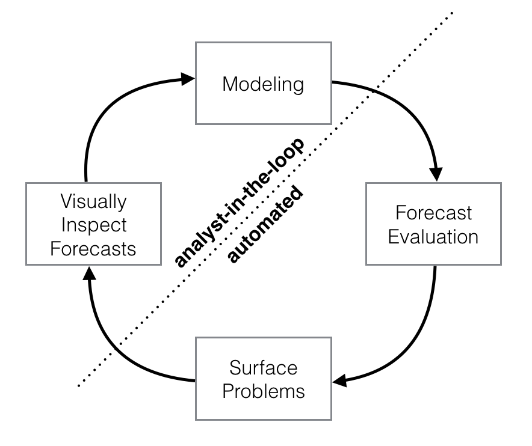

# Predictive modeling

Here we're going to use some epidemiological data collected during an influenza A (H7N9) outbreak in China in 2013. Of 134 cases with data, 31 died, 46 recovered, but 57 cases do not have a recorded outcome. We'll develop models capable of predicting death or recovery from the unlabeled cases. Along the way, we will: 

- Do some exploratory data analysis and data visualization to get an overall sense of the data we have.
- Extract and recode _features_ from the raw data that are more amenable to machine learning algorithms. 
- Impute missing data points from some of the predictor variables.
- Use a framework that enables consistent access to hundreds of classification and regression algorithms, and that facilitates automated parameter tuning using bootstrapping-based resampling for model assessment. 
- We will develop models using several different approaches (Random Forest, stochastic gradient boosting, elastic net regularized logistic regression, _k_-nearest neighbor) by training and testing the models on the data where the outcome is known
- We will compare the performance of each of the models and apply the best to predict the outcome for cases where we didn't know the outcome.

## Preprocessing

### Feature extraction

- Gender: instead of m/f, convert to binary indicator variable where 0=female, 1=male. 
- Hospitalization: create a binary classifier where  0=not hospitalized, 1=hospitalized.
- Dates: Let's take the _dates_ of onset, hospitalization, and outcome, and transform these into _days_ between onset and hospitalization, and days from onset to outcome. The algorithms aren't going to look at one column then another to do this math -- we have to extract this feature ourselves.
- Early onset: create another binary 0/1 indicating whether someone had an early outcome (earlier than the median outcome date observed).

```r
flu <- flu %>%
  mutate(male = gender=="m") %>% 
  select(-gender) %>%
  mutate(hospital = !is.na(date_hospitalization)) %>%
  mutate(days_to_hospital = as.numeric(date_hospitalization - date_onset)) %>%
  mutate(days_to_outcome  = as.numeric(date_outcome - date_onset)) %>%
  mutate(early_outcome = date_outcome < median(date_outcome, na.rm=TRUE)) %>%
  select(-starts_with("date")) %>%
  mutate_if(is.logical, as.integer)
```

- Province: along the same lines, let's create binary classifiers that indicate Shanghai, Zhejiang, Jiangsu, or other provinces.

```r
# Dummy code and bind back to original data
flu <- cbind(flu, model.matrix(~0+province, data=flu)) %>%
  as_tibble() %>%
  select(-province)
  
# Make new names
names(flu) <- gsub("province", "", names(flu))
```

### Imputation

```r
# Do the imputation without identifiers and outcomes
set.seed(42)
fluimp <- flu %>%
  select(-1, -2) %>%
  mice(print=FALSE) %>%
  complete()
  
# Bind back to data with identifiers and outcomes
fluimp <- flu %>%
  select(1,2) %>%
  cbind(fluimp) %>%
  as_tibble()
```

### Skip all the fun and just use the pre-processed data

```r
fluimp <- read_csv("data/h7n9_analysisready.csv")
```

## The **caret** package

The [**caret**](http://cran.r-project.org/web/packages/caret/index.html) package streamlines the process for creating and testing a wide variety of predictive models with different resampling approaches, and provides a uniform interface the functions themselves, as well as a way to standardize common tasks (such parameter tuning and variable importance).

Each of the models may have one or more _tuning parameters_ -- some value or option you can set to tweak how the algorithm develops. In k-nearest neighbors, we can try different values of _k_. With random forest, we can set the $m_{\text{try}}$ option -- the algorithm will select $m_{\text{try}}$ number of predictors to attempt a split for classification. Caret attempts to do this using a procedure as shown in **Fig 1.**


### Resampling 

The default resampling scheme caret uses is the [bootstrap](https://en.wikipedia.org/wiki/Bootstrapping_(statistics)). Bootstrapping takes a random sample _with replacement_ from your data that's the same size of the original data. Samples might be selected more than once, and some aren't selected at all. On average, each sample has a ~63.2% chance of showing up at least once in a bootstrap sample. Some samples won't show up at all, and these _held out_ samples are the ones that are used for testing the performance of the trained model. You repeat this process many times (e.g., 25, 100, etc) to get an average performance estimate on unseen data. This is shown in **Fig 2.**

### Notes on models

- **Random forests**^[<https://en.wikipedia.org/wiki/Random_forest>] are an ensemble learning approach based on classification trees. The CART (classification and regression tree) method searches through all available predictors to try to find a value of a single variable that splits the data into two groups by minimizing the impurity of the outcome between the two groups. The process is repeated over and over again until a hierarchical (tree) structure is created. But trees don't have great performance (prediction accuracy) compared to other models. Small changes in the data can drastically affect the structure of the tree. Tree algorithms are improved by ensemble approaches - instead of growing a single tree, grow many trees and aggregate (majority vote or averaging) the predictions made by the ensemble. The random forest algorithm is essentially:
    1. From the training data of _n_ samples, draw a bootstrap sample of size _n_.
    1. For each bootstrap sample, grow a classification tree, but with a small modification compared to the traditional algorithm: instead of selecting from all possible predictor variables to form a split, choose the best split among a randomly selected subset of $m_{\text{try}}$ predictors. Here, $m_{\text{try}}$ is the only tuning parameter. The trees are grown to their maximum size and not "pruned" back.
    1. Repeat the steps agove until a large number of trees is grown. 
    1. Estimate the performance of the ensemble of trees using the "out-of-bag" samples - i.e., those that were never selected during the bootstrap procedure in step #1. 
    1. Estimate the importance of each variable in the model by randomly permuting each predictor variable in testing on the out-of-bag samples. If a predictor is important, prediction accuracy will degrade. If the predictor isn't that helpful, performance doesn't deteriorate as much. 
- **Stochastic gradient boosting**^[<https://en.wikipedia.org/wiki/Gradient_boosting>], is similar, but uses a different method for building an ensemble of classification trees. It uses boosting instead of bagging.^[<https://quantdare.com/what-is-the-difference-between-bagging-and-boosting/>]
- **Elastic net regularization**^[<https://en.wikipedia.org/wiki/Elastic_net_regularization>] is a method that combines both the lasso^[<https://en.wikipedia.org/wiki/Lasso_(statistics)>] and ridge^[<https://en.wikipedia.org/wiki/Tikhonov_regularization>] methods of reguarizing a model. Regularization^[<https://en.wikipedia.org/wiki/Regularization_(mathematics)>] is a method for _penalizing_ a model as it gains complexity with more predictors in an attempt to avoid overfitting. 
- **K-nearest neighbor**^[<https://en.wikipedia.org/wiki/K-nearest_neighbors_algorithm>] attempts to assign samples to their closest labeled neighbors in high-dimensional space.


# Forecasting

## The Prophet Package

Forecasting is a common data science task that helps with things like capacity planning, goal setting, anomaly detection, and resource use projection. Forecasting can involve complex models, where overly simplistic models can be brittle and can be too inflexible to incorporate useful assumptions about the underlying data. 

Recently, the data science team at Facebook released as open-source a tool they developed for forecasting, called **prophet**, as both an R and python package.[^otherpkgs]

[^otherpkgs]: Google and Twitter have released as open-source similar packages: Google's **CausalImpact** software (<https://google.github.io/CausalImpact/>) assists with inferring causal effects of a design intervention on a time series, and Twitter's **AnomalyDetection** package (<https://github.com/twitter/AnomalyDetection>) was designed to detect blips and anomalies in time series data given the presence of seasonality and underlying trends. See also Rob Hyndman's **[forecast](https://cran.r-project.org/package=forecast)** package in R.


<!-- - Release blog post: https://research.fb.com/prophet-forecasting-at-scale/ -->
- Paper (preprint): https://peerj.com/preprints/3190/
- Project homepage :https://facebook.github.io/prophet/
- Documentation: https://facebook.github.io/prophet/docs/quick_start.html
- R package: https://cran.r-project.org/web/packages/prophet/index.html
- Python package: https://pypi.python.org/pypi/fbprophet/
- Source code: https://github.com/facebook/prophet

Prophet is optimized for forecasting problems that have the following characteristics:

- Hourly, daily, or weekly observations with at least a few months (preferably a year) of history
- Strong multiple "human-scale" seasonalities: day of week and time of year
- Important holidays that occur at irregular intervals that are known in advance (e.g. the Super Bowl)
- A reasonable number of missing observations or large outliers
- Historical trend changes, for instance due to product launches or logging changes
- Trends that are non-linear growth curves, where a trend hits a natural limit or saturates

These use cases are optimized for business forecasting problems encountered at Facebook, but many of the characteristics here apply well to other kinds of forecasting problems. Further, while the default settings can produce fairly high-quality forecasts, if the results aren't satisfactory, you aren't stuck with a completely automated model you can't change. The prophet package allows you to tweak forecasts using different parameters. The process is summarized in **Fig 3.** 


**[Prophet](https://cran.r-project.org/package=prophet)** is a good replacement for the **[forecast](https://cran.r-project.org/package=forecast)** package because:

1. **Prophet makes it easy.** The forecast package offers many different techniques, each with their own strengths, weaknesses, and tuning parameters. While the choice of parameter settings and model specification gives the expert user great flexibility, the downside is that choosing the wrong parameters as a non-expert can give you poor results. Prophet's defaults work pretty well. 
2. **Prophet's forecasts are intuitively customizable.** You can choose smoothing parameters for seasonality that adjust how closely you fit historical cycles, and you can adjust how agressively to follow historical trend changes. You can manually specify the upper limit on growth curves, which allows for you to supplement the automatic forecast with your own prior information about how your forecast will grow (or decline). You can also specify irregular events or time points (e.g., election day, the Super Bowl, holiday travel times, etc) that can result in outlying data points.

The prophet procedure is essentially a regression model with some additional components:

1. A piecewise linear or logistic growth curve trend. Prophet automatically detects changes in trends by selecting changepoints from the data.
1. A yearly seasonal component modeled using Fourier series.
1. A weekly seasonal component using dummy variables.
1. A user-provided list of important holidays.

See the prophet preprint for more.^[Taylor SJ, Letham B. (2017) Forecasting at scale. _PeerJ Preprints_ 5:e3190v2 <https://doi.org/10.7287/peerj.preprints.3190v2>]

\newpage

{width=5.5in}

\bigskip

{width=5in}

\bigskip

{width=3.5in}
